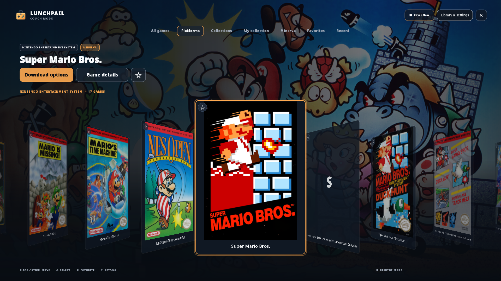
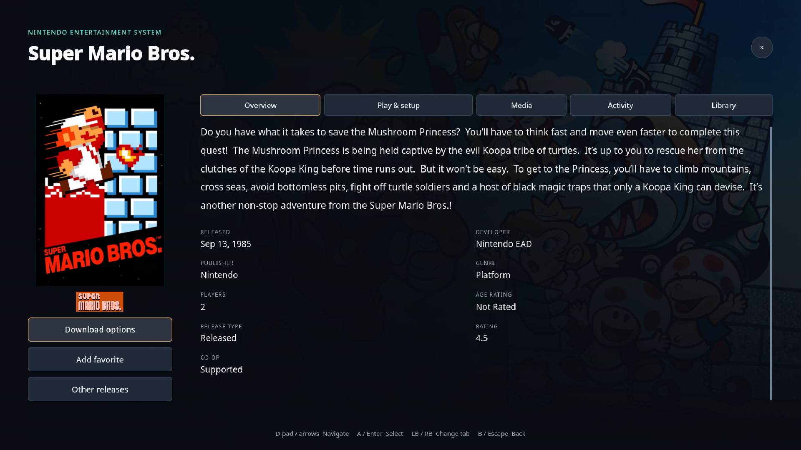
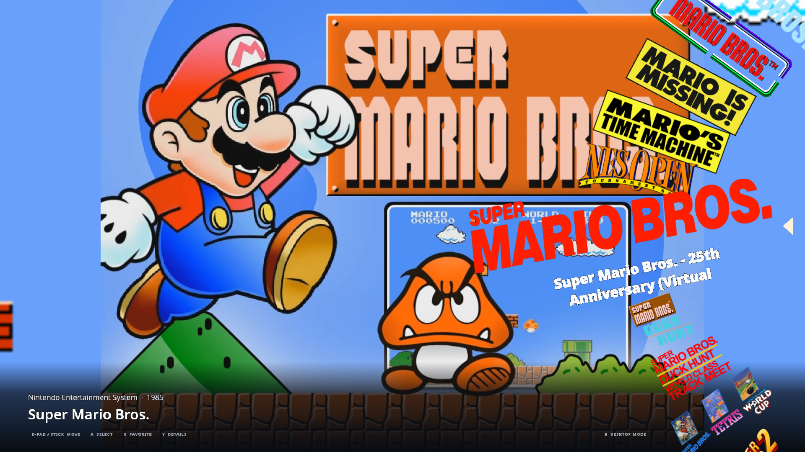
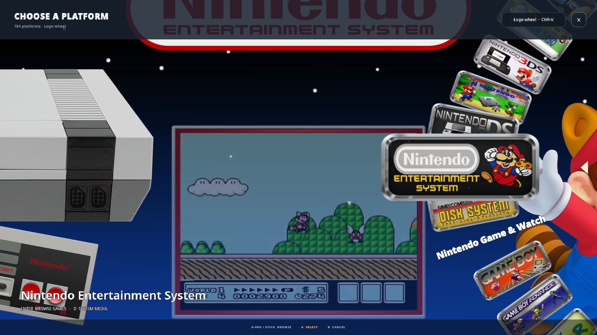

# Couch Mode

Couch Mode is a fullscreen way to browse the same library with a controller,
keyboard, or mouse. Open it from the main window's Couch Mode control.

## Choose a view

| View | Best for |
| --- | --- |
| Cover wall | Seeing many covers at once. |
| Cover flow | Browsing angled covers around a prominent selected game. |
| Logo wheel | A curved, animated list of game logos beside a video preview. Missing logos use readable titles. |
| Cover shelf | A horizontal cover row with stable spacing and a selected-game preview. |

Use the view button, **Library & settings**, or the Couch Mode section in
Settings. Press **Ctrl+V** to cycle views from the keyboard. The platform picker
has the same wall, wheel, cover-flow, and shelf presentations and its own view
button. With the platform picker open, the controller's Menu button (or Tab)
also cycles views. The saved presentation choice applies to platforms and games.

Lunchpail remembers the view and keeps the selected game and platform when you
switch. Pausing the pointer over a card selects it without opening or launching
anything; controller navigation works even with the pointer parked over a card.
In every game view, selection plays the HyperSpin video theme as a full-window
background. Missing themes are looked up individually using the saved EmuMovies
account, with one transfer at a time and the latest selection taking priority.
Cached gameplay and then the selected platform's theme are fallbacks, labeled
on screen. Changing views keeps playback and the shared mute preference. Games
without any available video keep their artwork presentation.

## Browse and play

Switching from desktop mode follows the open game-details page (or the selected
game when details are closed). Couch Mode opens that game's platform and pins the
same game through asynchronous filtering; an older saved Couch shelf does not
replace it. A game hidden by an additional library filter is identified explicitly
instead of silently selecting another title.

The logo wheel packs eleven entries onto a curved path: neighbors tilt and shrink,
while the selected logo glides forward and enlarges. Cover flow stacks angled
covers around a larger front-facing selection with fading floor reflections. The
wall brings cards in with a staggered zoom and gently lifts the selection and its
neighbors. These effects apply to games and platforms, with readable wordmarks
when artwork is missing.

Wheel ticks, wall steps, cover-flow swishes, button focus, confirmation, back, view
changes, entry, and launch use short original sound cues. Mouse buttons and
controller/keyboard actions share the same feedback. Rapid browsing is
rate-limited; movement does not cut off a confirmation or launch sound. The saved
sound-volume and mute controls apply to every cue.

Choose a shelf such as My Collection, Favorites, or Recent. The platform and
collection pickers narrow the same library used by normal mode.

Use up/down through the wheel, left/right through cover flow or the shelf, and
both directions through the wall. Select a game to see its actions, then choose
Play or download options.

The Game Menu includes favorite, release, view, and attract-mode choices.

## Search with a keyboard or microphone

Start typing letters or numbers while browsing games or platforms to open the
large search panel in literal-search mode. **F3** or the Search
button opens the current query. Results update in the current shelf/platform;
Enter or Escape returns to those results. Back once more clears the query before
leaving Couch Mode. The Game Menu's **Search games · voice or keyboard** action
opens the same panel with a controller. In the panel, the D-pad selects the mic,
clear, browse, or Ask AI button, and the south face button activates it.

Select **Hands-free · Enable** once. If a model is missing, answer **Yes** to
**Install a model?** Lunchpail downloads and verifies the recommended 191 MB
English streaming model, then enables listening automatically. **No** does
nothing. Say “Lunchpail, Super Mario Brothers” or “OK Lunchpail”, then a title
within eight seconds. Only wake-prefixed speech reaches search; ambient
transcripts are not shown or sent to the assistant. Commands run after a pause.
The visible **Mic on** button turns listening off. Hands-free is off by default;
its opt-in is saved. It suspends when Couch mode is hidden, the window loses
focus, another dialog takes input, or a game is running. A microphone failure
stops listening until you explicitly retry. The selected speech model is used;
no additional wake model is silently downloaded.

**F2** or **Speak** remains available for one-shot capture. On first use, the
same Yes/No installation prompt continues into capture when ready.
Sherpa's English recognizer updates the editable query while you speak; Whisper
returns the completed utterance after capture. Capture
stops at a speech pause, after 15 seconds, when you press Stop, or when you leave
the panel. Typing cancels voice input so late results cannot replace your edits.
Audio is never saved or uploaded. A network connection is only needed for model
setup; recognition then works offline. Voice search never installs or launches a
game. Search accepts spoken “Brothers” for titles written “Bros.” while keeping
literal matches too. Unusual game titles may need a keyboard correction.

Navigation uses quiet movement, confirm, and back sounds. Their saved toggle and
volume are in **Settings → Couch Mode**, separately from video and music settings.
While recording a command, navigation sounds and preview audio are silenced
without changing the shared video mute preference or the music's paused state.
Passive hands-free wake listening does not mute playback.

The recognizer is [sherpa-onnx](https://github.com/k2-fsa/sherpa-onnx), Apache-2.0,
with the Apache-2.0 [English streaming Zipformer model](https://huggingface.co/csukuangfj/sherpa-onnx-streaming-zipformer-en-2023-06-21).
Model files are revision-pinned and SHA-256 checked before use, and stored in the
application data directory under `speech/zipformer-en-2023-06-21`. Whisper models
are stored under `ai/models`. To choose another
microphone, change your operating system's default input device before starting
voice search.

## Local assistant setup

This feature is in the development build; older release packages do not include
the bundled inference workers.

Open Couch Mode search, choose **Ask AI**, type a question and press Enter. If
needed, answer **Yes** to install **Qwen3 4B (2.50 GB)**. Installation, resumable
downloads, SHA-256 verification, and CPU/GPU selection are automatic; the question
continues after installation. Voice and assistant models are installed separately
only when requested. No Ollama, Python, account, or separate server is needed.

**Settings → Local AI & voice → Advanced options** retains the other model and
compute choices. Whisper Base English (148 MB), Tiny English (78 MB), and Small
Multilingual (488 MB) support CPU/GPU; Sherpa (191 MB) uses CPU. Qwen 0.8B uses less
memory but can be less reliable with tools; 8B needs more memory. Selecting an
advanced model downloads it immediately. **Speak / F2** submits voice questions
only when recognition finishes, not on partial transcripts. Hands-free wake
search is literal game search, not an implicit AI/tool request.

For example: “Find me a good SNES JRPG with an English translation patch.”
Follow up with “Only ones I have installed.” **New question** clears the prior
conversation. The assistant does not change the normal shelf filter.

Windows/Linux GPU workers use Vulkan for compatible AMD, NVIDIA and Intel
drivers; Apple Silicon uses Metal. **Check hardware** reports detected GPUs;
an answer reports the device actually used. Auto retries a CPU-only worker if
the GPU fails; GPU-required mode reports an error. RAM/VRAM requirements exceed
the model's file size. The CPU fallback does not require a GPU driver.

The Rust application embeds integration with llama.cpp and whisper.cpp through
isolated, bundled helper executables. They are part of the package, not services
the user must start. Build them during development with
`python3 packaging/build-inference.py`; `dev.sh` does this automatically. GPU builds
need the platform's Vulkan SDK/shader compiler or Xcode tools, while end users
only need a compatible graphics driver. Keep all four worker executables beside
the packaged app. The developer SDK is never installed on users' machines.

Prompts and audio stay on the device. Patch lookup contacts the selected provider
using the catalog game's title/platform, not the audio or entire conversation.
Recommendations are read-only: no game download, launch, patch download, or
patch application tool exists. Game cards must use IDs retrieved from the catalog;
patch cards must come from a provider result. Adult and non-retail games are
excluded from this first assistant version. The model selects recommendations;
the app constructs factual summaries from tool evidence instead of displaying
unverified generated availability claims. Selections can still be mistaken.
Patch matches are candidates; translation completeness and
compatibility with your ROM remain unknown until checked. See [patches](patches.md)
for provider coverage, API keys and the separate manual review/apply workflow.

This assistant/speech setup is independent of the older **live in-game OCR
translation** feature, whose Ollama/GPU requirements are described in
[translation](translation.md).

### Optional MCP access

Other MCP clients can start the installed executable with `--mcp-stdio` and,
optionally, `--database /absolute/path/to/lunchpail.db`. It serves the same
`search_games`, `game_details`, and `translation_patches` tools using the official
Rust MCP SDK. It does not open a network port, start the GUI, download models,
or run an LLM. A client already supplying its own LLM does not need a Lunchpail
assistant model. Stdio startup is opt-in; the built-in assistant needs no MCP
configuration. Only connect a client you trust with your game catalog and
installed-status metadata.

## Game details and tools

**Game details & tools** opens a full-screen page with five tabs: Overview,
Play & setup, Media, Activity, and Library. A large green **Install / Play** button
stays at the top of every tab and is the default controller action. **Install**
opens the version and download review before anything is queued; installed games
show **Play** when ready. If setup is needed, the button opens launch settings.
Downloads in progress show installation status and open the queue, including
paused or failed installs. Favorites and other releases stay beside the cover.
Use the bumpers to switch tabs, then the D-pad to choose a tool.

Play & setup includes display settings, controller mappings, patches and cheats,
RetroAchievements, ROM choices, and save locations. **Emulator & launch** includes
runtime selection, game/system defaults, launch profiles, BIOS setup, GameBuddy,
and PC installation preparation. Management sections stay in a full-screen game
page with a persistent section rail; they do not open the normal details sidebar.

Overview includes available release, developer, publisher, genre, player, region,
series, age-rating, and catalog-rating information. Activity includes completion,
notes, and session history. Library provides metadata editing, collection
membership, related games, custom fields, tags, and external catalog links.

**Library & settings** opens settings, downloads, notifications, imports,
collections, firmware, media tools, and bulk editing. The full library
workspace is available for search, sorting, and organization.

Use **Back to Couch Mode** to return from that workspace without losing the
selected game.

Focused editors such as metadata, controller mapping, and launch profiles still
use shared dialogs above the game page. Text entry and
native file pickers may need a keyboard or mouse; not every workflow is a
controller-only, TV-sized interface yet.

## Wheel logos

The wheel uses transparent game-title images, usually called **clear logos**
or **wheel logos**. Lunchpail checks your configured artwork providers for
the actual logo rather than substituting a box cover. EmuMovies and ScreenScraper
are useful sources; connect them in Settings. Coverage varies by game and release.

If a logo is missing or incorrect, open **Media → Find better media** to choose
another image. Until a logo is available, the wheel shows the game's title.

## HyperSpin video themes and system media

Open **Media → Themes & system media** (or **Themes & systems** in the section rail) to
find a pre-rendered HyperSpin game theme, a system wheel logo, or a platform video
through your connected EmuMovies account. Theme videos require FTP access from a
supporting EmuMovies account. Availability varies by system and game.

Game themes are stored separately from gameplay videos. All four game views
automatically request a missing individual theme and gameplay video after selection
settles; browsing never downloads whole video packs. While a game video is missing,
the game's artwork stays visible instead of playing a platform video. The media
status below the categories shows queued/look-up/download activity, transfer
percentages, missing-account guidance, or unavailable media. Hover it for details.
Unavailable themes are remembered for the session; network failures can retry
when you reselect the game. Backgrounds preserve aspect ratio, can be paused or
opened full-screen, and share the global video mute preference. Background music
stops while an audible preview is playing. Opening another page suspends previews.

The platform picker displays cached system logos and automatically finds a missing
individual system video after selection settles. All four platform views use the
video as a full-window background and show lookup/availability status and download
progress. System videos are only used in the platform browser. Game and
system lookups share one transfer queue; rapid scrolling cancels the old selection
and keeps only the latest request. Local custom videos take priority and do not
require an account. These use a separate system-media cache, never a game's box
art or logo slot. Missing system videos leave the normal artwork background intact.

This supports the [pre-rendered themes published by EmuMovies](https://emumovies.com/files/category/2031-video-themes/),
not execution of raw HyperSpin theme packages. EmuMovies also publishes
[system and game logo artwork](https://emumovies.com/files/category/1196-artwork/).

## Useful controls

- D-pad or left stick: move.
- South face button: select.
- East face button: back or close the current panel.
- Bumpers: page through the focused list.
- **F3**: search. **F2**: voice search/setup.
- **Ctrl+F**: favorite. **Ctrl+D**: details. **Ctrl+M**: game menu.
- **Ctrl+O**: Library & settings. **Ctrl+V**: change view.
- **Ctrl+A**: attract mode. **Ctrl+P**: pause/resume background music.

When a dialog is open, controller navigation stays with that dialog rather
than moving the game list behind it.

## Attract mode, music, and themes

Attract mode tours games from the current shelf. Start it from the Game Menu
or choose an idle delay in Settings.

Background game music is optional and uses available cached media. You can
adjust or mute it in the Couch Mode settings.

See [Themes](themes.md) to change colors and background artwork.
